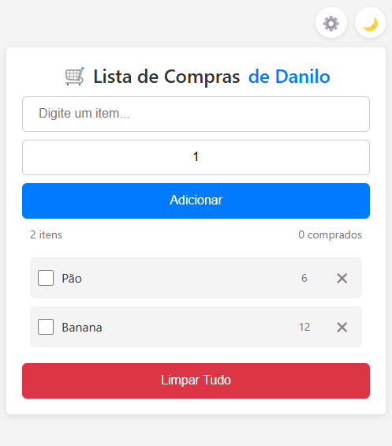

# 🛒 Lista de Compras

🔗 [Acesse a Lista de Compras Online](https://ddcsilva.github.io/ListaDeCompras/)

Uma aplicação web moderna e responsiva para gerenciar sua lista de compras do dia a dia. Desenvolvida com HTML, CSS e JavaScript puro.

## ✨ Funcionalidades

- ✅ Adicionar itens com quantidade
- ✅ Marcar itens como comprados
- ✅ Remover itens individualmente
- ✅ Limpar toda a lista
- 🌙 Tema escuro/claro
- 📱 Design responsivo
- 💾 Salvamento automático
- 🔝 Botão "Voltar ao topo"
- 📊 Contador de itens

## 🚀 Tecnologias Utilizadas

- HTML5
- CSS3
  - Variáveis CSS
  - Flexbox
  - Media Queries
  - Transições e Animações
- JavaScript (ES6+)
  - LocalStorage
  - Event Listeners
  - Manipulação do DOM

## 🎨 Interface

A aplicação possui uma interface limpa e intuitiva:

- **Cabeçalho**: Título da aplicação
- **Seção de Adição**: Campo para adicionar novos itens com quantidade
- **Lista de Itens**: Exibe todos os itens com opções de marcar como comprado e remover
- **Rodapé**: Botão para limpar toda a lista
- **Botão de Tema**: Alterna entre tema claro e escuro
- **Botão "Voltar ao Topo"**: Aparece ao rolar a página

## 🎯 Como Usar

1. Abra o arquivo `index.html` em seu navegador
2. Digite o nome do item no campo de texto
3. Ajuste a quantidade desejada
4. Clique em "Adicionar" ou pressione Enter
5. Marque os itens como comprados clicando no checkbox
6. Remova itens clicando no botão ✖
7. Use o botão de tema 🌙/☀️ para alternar entre temas
8. O botão "Voltar ao Topo" ↑ aparece ao rolar a página

## 💾 Armazenamento

- Todos os dados são salvos automaticamente no `localStorage` do navegador
- A lista persiste mesmo após fechar o navegador
- O tema escolhido também é salvo

## 📱 Responsividade

A aplicação é totalmente responsiva e funciona bem em:
- Desktop
- Tablet
- Smartphone

## 🛠️ Desenvolvimento

Para contribuir com o projeto:

1. Faça um fork do repositório
2. Crie uma branch para sua feature (`git checkout -b feature/nova-feature`)
3. Commit suas mudanças (`git commit -m 'Adiciona nova feature'`)
4. Push para a branch (`git push origin feature/nova-feature`)
5. Abra um Pull Request

## 📝 Licença

Este projeto está sob a licença MIT. Veja o arquivo [LICENSE](LICENSE) para mais detalhes.

## 👨‍💻 Autor

**Danilo** - [Seu GitHub](https://www.linkedin.com/in/ddcsilva/)